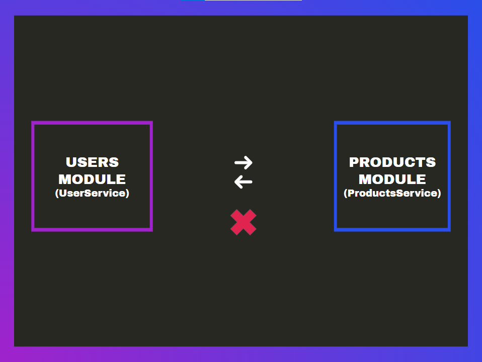
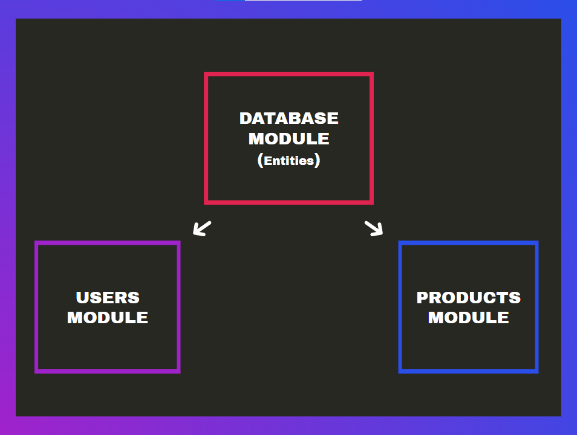

# Cómo solucionar una referencia circular entre módulos

NestJS Realmente es un framework potente que nos permite tener una arquitectura sólida y escalable. Pero al conectarnos con bases de datos podemos llegar a enfrentarnos a una **referencia circular**, problema que debemos evitar y/o aprender a solucionar.

En nuestro proyecto tenemos a _UsersModule_ que importa a _ProductsModule_ con el fin usar al ProductsService. Pero ¿qué pasa si _ProductsModule_ necesita hacer una consulta hacia users? Recuerda que dentro de _UsersModule_ está el _UserService_ y la entidad de _Users_. Si importamos a UserModule dentro de _ProductsModule_, tendríamos un problema de **referencia circular entre módulos**.




Existen dos maneras de solucionarlo si llegas a tener este caso.

## Solución 1: entidades en un Global Module

<hr>

Una de las soluciones es poner todas las entidades de tu proyecto en el DatabaseModule de manera global haciendo que cada uno de los demás módulos pueda usar estas entidades sin tener problemas de referencia circular.



De esta manera cada módulo puede usar el Repository Pattern y hacer la consulta que necesite de una entidad, puedes ver un ejemplo de esta solución en la [rama 21](https://github.com/platzi/nestjs-typeorm-datos/tree/21-step) y detalle de [cambios](https://github.com/platzi/nestjs-typeorm-datos/commit/e148130525c0f415389f6089186990524496fdf7) 😎

## Solución 2:  Referencia directa

Una de las formas que tiene NestJS para resolver la referencia circular es tener una referencia directa por ejemplo, si AService y BService dependen el uno del otro, ambos lados de la relación pueden usar __@Inject ()__ y la utilidad __forwardRef ()__ para resolver la dependencia circular, ejemplo:

```ts
@Injectable()
export class AService {
  constructor(
    @Inject(forwardRef(() => BService ))
    private service: BService ,
  ) {}
}
```

De la misma manera en el otro servicio.

```ts
@Injectable()
export class BService {
  constructor(
    @Inject(forwardRef(() => AService ))
    private service: AService ,
  ) {}
}
```

También puedes aplicar lo mismo entre módulos

```ts
@Module({
  imports: [forwardRef(() => AModule)],
})
export class BModule{}
```

```ts
@Module({
  imports: [forwardRef(() => BModule)],
})
export class AModule{}
```
